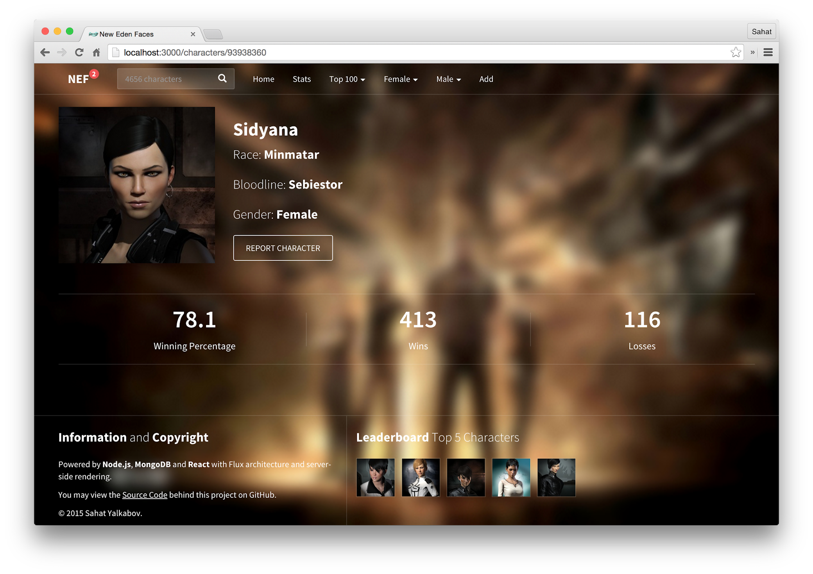

# ⚔️ Lik - Character Voting App for EVE Online 🚀


Welcome to **Lik**, the ultimate **character voting app** designed specifically for the **EVE Online** community! ⚔️ This app provides EVE Online players with an interactive and engaging platform to vote for their favorite characters, view real-time voting results, and interact with fellow players. Whether you're a capsuleer supporting your favorite faction or a collector of in-game lore, **Lik** offers a fun and dynamic way to participate in the EVE Online universe.

The app utilizes modern web technologies like **React**, **Node.js**, **MongoDB**, and **Socket.IO** to provide a seamless user experience, ensuring fast updates, smooth interactions, and robust data storage. You can vote, track voting trends, and even view community-based voting patterns, all in real-time.



## ✨ Features  
- 🗳️ **Character Voting**: Cast your votes for characters within the EVE Online universe.
- 🌐 **Real-Time Updates**: Real-time voting results using **Socket.IO** for smooth interaction.
- 🔒 **User Authentication**: Secure login and registration for users.
- 📊 **Voting Analytics**: Visual representation of the voting data.
- 🧑‍🤝‍🧑 **Community Engagement**: View and interact with votes cast by others in the EVE community.

## 🛠️ Tech Stack  
- ⚛️ **React** for building the front-end.
- 🖥️ **Node.js** and **Express** for handling the back-end API.
- 🗄️ **MongoDB** for data storage.
- 🔌 **Socket.IO** for real-time communication.
- 🔑 **JWT Authentication** for secure user login.

## 🏅 Acknowledgments

This project is inspired by and based on the educational project **[New Eden Faces (React)](https://github.com/sahat/newedenfaces-react)**, which provided valuable insights and resources during the development of this app. I have learned a lot from this project and it has been an essential guide for building the final version of **Lik**. 

A special thank you to **Sahat** for creating and sharing the source code for building a character voting app using **React**, **Node.js**, **MongoDB**, and **Socket.IO**. The learning materials and structure of this project have been instrumental in developing the features of **Lik**.

## 🛡️ Legal Disclaimer  
This app is designed for **EVE Online** players for the purpose of community interaction and voting. It is not officially affiliated with **EVE Online** or **CCP Games**.

## 🤝 Contributions  
Contributions are welcome! Feel free to fork the project, submit pull requests, or open issues for improvements.  

## 📄 License  
This project is licensed under the **MIT License**. See the LICENSE file for details.  

## Visitors Count


 
 ## Please Share & Star the repository to keep me motivated.
  <a href = "https://github.com/sergio11/lik/stargazers">
     
  </a>

## License ⚖️

This project is licensed under the MIT License, an open-source software license that allows developers to freely use, copy, modify, and distribute the software. 🛠️ This includes use in both personal and commercial projects, with the only requirement being that the original copyright notice is retained. 📄

Please note the following limitations:

- The software is provided "as is", without any warranties, express or implied. 🚫🛡️
- If you distribute the software, whether in original or modified form, you must include the original copyright notice and license. 📑
- The license allows for commercial use, but you cannot claim ownership over the software itself. 🏷️

The goal of this license is to maximize freedom for developers while maintaining recognition for the original creators.

```
MIT License

Copyright (c) 2024 Dream software - Sergio Sánchez 

Permission is hereby granted, free of charge, to any person obtaining a copy
of this software and associated documentation files (the "Software"), to deal
in the Software without restriction, including without limitation the rights
to use, copy, modify, merge, publish, distribute, sublicense, and/or sell
copies of the Software, and to permit persons to whom the Software is
furnished to do so, subject to the following conditions:

The above copyright notice and this permission notice shall be included in all
copies or substantial portions of the Software.

THE SOFTWARE IS PROVIDED "AS IS", WITHOUT WARRANTY OF ANY KIND, EXPRESS OR
IMPLIED, INCLUDING BUT NOT LIMITED TO THE WARRANTIES OF MERCHANTABILITY,
FITNESS FOR A PARTICULAR PURPOSE AND NONINFRINGEMENT. IN NO EVENT SHALL THE
AUTHORS OR COPYRIGHT HOLDERS BE LIABLE FOR ANY CLAIM, DAMAGES OR OTHER
LIABILITY, WHETHER IN AN ACTION OF CONTRACT, TORT OR OTHERWISE, ARISING FROM,
OUT OF OR IN CONNECTION WITH THE SOFTWARE OR THE USE OR OTHER DEALINGS IN THE
SOFTWARE.
```
